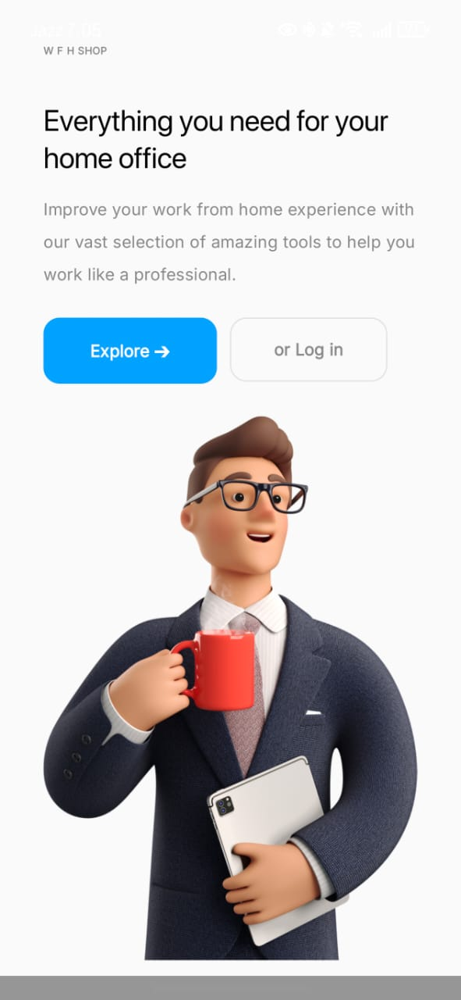
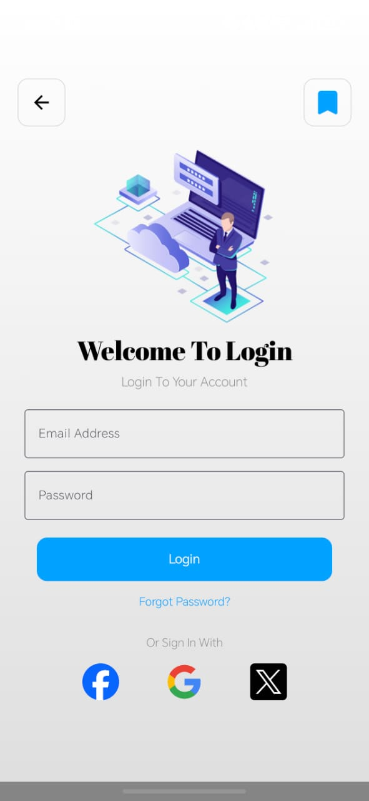
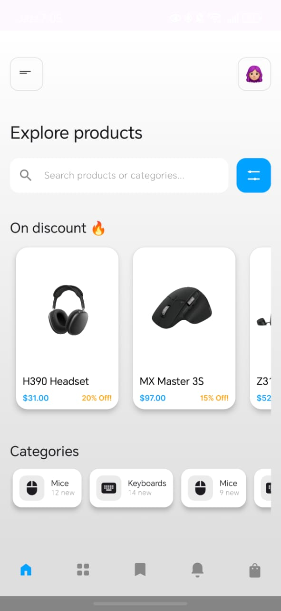
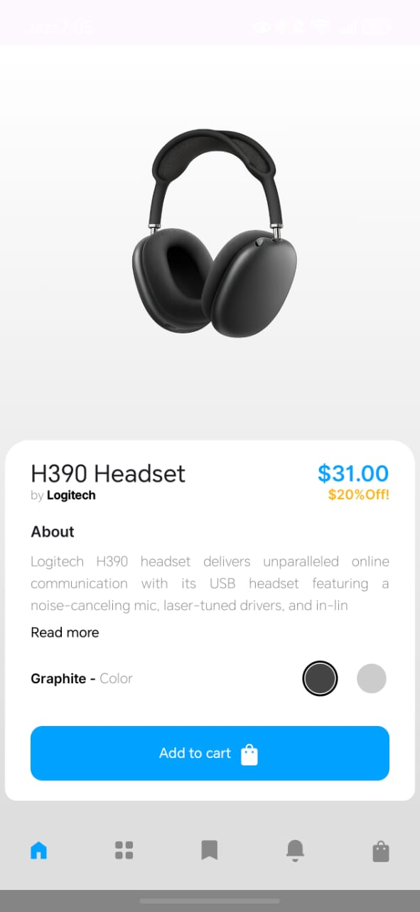
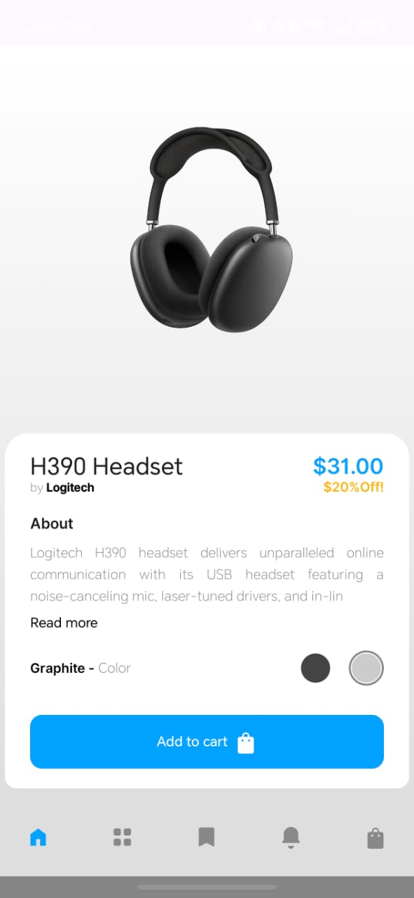
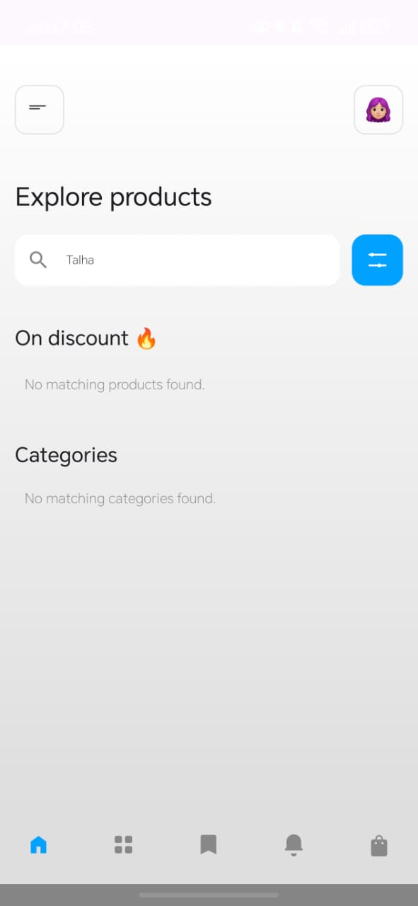

<div align="center">


# 📱 TechStore App

### Plataforma móvil moderna para compra de productos tecnológicos 🚀

<p align="center">
  <b>TechStore App</b> es una aplicación móvil e-commerce desarrollada con Jetpack Compose, enfocada en ofrecer una experiencia visual premium para la compra de dispositivos y gadgets tecnológicos.
</p>

<p align="center">
  
  
  
  
</p>

<p align="center">
  <a href="#-acerca-del-proyecto">Acerca</a> •
  <a href="#-características">Características</a> •
  <a href="#-tecnologías-utilizadas">Tecnologías</a> •
  <a href="#-capturas-de-pantalla">Capturas</a> •
  <a href="#-instalación">Instalación</a>
</p>

</div>

---

# 🌌 Acerca del proyecto

**TechStore App** es una aplicación móvil de comercio electrónico enfocada en la venta de productos tecnológicos y gadgets modernos.

La aplicación fue desarrollada completamente con **Jetpack Compose**, priorizando:

- 📱 Interfaces modernas
- 🎨 Diseño elegante y dinámico
- ⚡ Navegación fluida
- 🛒 Experiencia de compra intuitiva
- 💻 Arquitectura escalable
- 🔥 Alto rendimiento visual

El proyecto utiliza el patrón arquitectónico **MVVM (Model–View–ViewModel)** para mantener una estructura limpia, organizada y mantenible.

---

# ✨ Características

## 🛒 Sistema E-Commerce

- 📦 Catálogo de productos
- 🔎 Búsqueda inteligente
- 🛍️ Vista detallada de productos
- 🎨 Cambio dinámico de colores
- ❤️ Experiencia visual moderna

---

## 👤 Gestión de usuarios

- 🔐 Pantalla de login
- 👥 Gestión de usuarios
- ⚡ Navegación intuitiva
- 📱 Flujo optimizado para móviles

---

## 🎨 Diseño UI/UX

- ✨ Material Design 3
- 📱 Responsive Design
- 🎨 Interfaz minimalista
- ⚡ Animaciones fluidas
- 🧩 Componentes reutilizables

---

## ⚙️ Arquitectura MVVM

- 🧠 Separación de responsabilidades
- 🔄 Manejo de estado
- 📡 Flujo de datos reactivo
- 📂 Código organizado y escalable

---

# 👨‍💼 Módulos del sistema

## 🚀 Splash Module

Pantalla inicial animada de carga.

### Funcionalidades

- Animación de inicio
- Branding de la app
- Transición automática

---

## 🔐 Authentication Module

Sistema de autenticación y acceso.

### Funcionalidades

- Login de usuarios
- Navegación protegida
- Flujo de autenticación

---

## 🏠 Home Module

Pantalla principal de productos.

### Funcionalidades

- Listado de gadgets
- Categorías tecnológicas
- Navegación rápida
- Diseño dinámico

---

## 📦 Product Module

Módulo de detalles del producto.

### Funcionalidades

- Información detallada
- Cambio de colores
- Vista interactiva
- Experiencia premium

---

# 🛠️ Tecnologías utilizadas

## ⚙️ Desarrollo Android

<p>
  
</p>

- Kotlin
- Android Studio
- Android SDK
- Jetpack Compose

---

## 🎨 UI Framework

<p>
  
</p>

- Jetpack Compose
- Material 3
- Compose Navigation
- Responsive Layouts

---

## 🧠 Arquitectura y estado

- MVVM Architecture
- Compose State
- Kotlin Flow
- State Management

---

## 🖼️ Librerías

- Coil Image Loading
- Compose Navigation
- Material Components

---

# 📂 Estructura del proyecto

```bash
PlataformaShopingProductosTecnologicos/
│
├── app/
│   ├── screens/               # Pantallas Compose
│   ├── components/            # Componentes reutilizables
│   ├── navigation/            # Navegación
│   ├── models/                # Modelos de datos
│   ├── viewmodel/             # ViewModels MVVM
│   ├── ui/theme/              # Temas y estilos
│   └── utils/                 # Utilidades
│
├── app_screenshots/           # Capturas de pantalla
├── build.gradle
├── settings.gradle
└── README.md
```

---

# 📱 Capturas de pantalla

## 🚀 Splash Screen



---

## 🔐 Login Screen



---

## 🏠 Home Screen



---

## 📦 Product Description



---

## 🎨 Product Color Change



---

## 🔎 Search System



---

# ⚡ Instalación

## 📋 Requisitos

- Android Studio
- Kotlin
- Android SDK
- Gradle
- Emulador Android o dispositivo físico

---

# 🚀 Configuración del proyecto

## 1️⃣ Clonar repositorio

```bash
git clone https://github.com/isairey/PlataformaShopingProductosTecnologicos.git
```

---

## 2️⃣ Entrar al proyecto

```bash
cd PlataformaShopingProductosTecnologicos
```

---

## 3️⃣ Abrir en Android Studio

Seleccionar:

```bash
Open Existing Project
```

---

## 4️⃣ Sincronizar dependencias

```bash
Sync Gradle Project
```

---

## 5️⃣ Ejecutar aplicación

```bash
Run App
```

o usar:

```bash
Shift + F10
```

---

# 📊 Funcionalidades principales

## 🛒 Sistema de productos

- Catálogo dinámico
- Visualización moderna
- Interfaz intuitiva
- Búsqueda integrada

---

## 📱 Navegación móvil

- Compose Navigation
- Transiciones fluidas
- Flujo optimizado

---

## 🎨 UI moderna

- Material 3
- Componentes Compose
- Diseño minimalista
- Experiencia premium

---

# 🧠 Objetivos del proyecto

## 🎯 Aprendizaje y desarrollo

- Desarrollo Android moderno
- Jetpack Compose
- Arquitectura MVVM
- Navegación Compose
- Manejo de estados
- UI/UX móvil
- Kotlin avanzado

---

# 🚧 Roadmap

## 🔮 Próximas mejoras

- ❤️ Lista de favoritos
- 🛒 Carrito de compras
- 💳 Pasarela de pagos
- 🔔 Notificaciones push
- ☁️ Backend en Firebase
- 🌐 API REST
- 📦 Sistema de órdenes
- 👤 Perfil de usuario

---

# 🤝 Contribuciones

Las contribuciones son bienvenidas ❤️

## Cómo contribuir

1. Fork del proyecto

```bash
git checkout -b feature/nueva-funcionalidad
```

2. Commit

```bash
git commit -m "✨ Nueva funcionalidad"
```

3. Push

```bash
git push origin feature/nueva-funcionalidad
```

4. Pull Request 🚀

---

# 👨‍💻 Desarrollador

<div align="center">

## Isai Reyes — Android Developer

Desarrollador apasionado por aplicaciones móviles modernas, interfaces elegantes y experiencias premium en Android 🚀

</div>

---

# 🌟 Apoya el proyecto

⭐ Dale una estrella  
🍴 Haz fork  
📢 Comparte el proyecto

---

# 📜 Licencia

Proyecto open source orientado al aprendizaje y desarrollo de aplicaciones móviles modernas con Android y Jetpack Compose.

---

<div align="center">

### 📱 TechStore App — experiencia premium para compras tecnológicas 🚀

</div>
